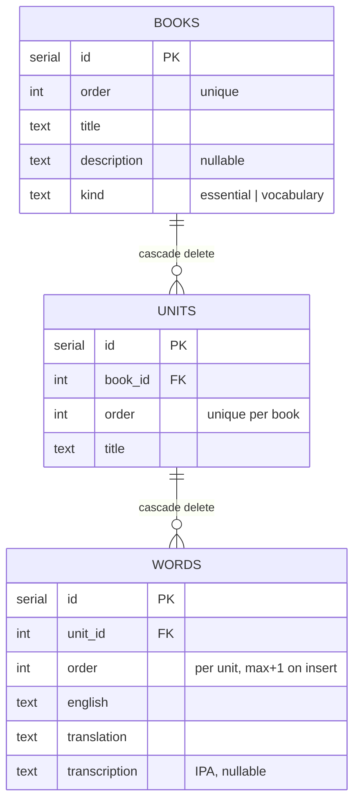

# Essential English Words

A vocabulary-learning web app built around the *Essential English Words* book series: browse **Books → Units → Words**, search the whole dictionary, and drill yourself with generated quizzes. Reading is public; a single shared admin password unlocks word management.

<p>
  
  
  
  
  
  
</p>

---

## Table of contents

- [Features](#features)
- [Tech stack](#tech-stack)
- [Repository layout](#repository-layout)
- [Quick start](#quick-start)
- [Environment variables](#environment-variables)
- [Scripts](#scripts)
- [Architecture](#architecture)
- [Data model](#data-model)
- [API reference](#api-reference)
- [Authentication model](#authentication-model)
- [Internationalization](#internationalization)
- [IPA transcriptions](#ipa-transcriptions)
- [Testing](#testing)
- [Deployment](#deployment)
- [Conventions](#conventions)

---

## Features

**For learners**

- **Book & unit browsing** — 2 seeded books × 30 units, with per-unit word tables, pagination and live word counts.
- **Global dictionary search** — case-insensitive search across every word, with the book/unit each hit belongs to.
- **Quiz mode** (`/test`) — pick a single unit, or a range spanning units and books:
  - **Easy** — 4 multiple-choice options, distractors drawn only from the selected scope.
  - **Hard** — type the English answer; grading is case- and whitespace-insensitive.
  - Both directions (`uz→en`, `en→uz`), configurable question count, streak tracking and tiered encouragement feedback.
- **British IPA transcriptions** shown next to English terms, including inside quizzes.
- **Vocabularies collection** (`/vocabulary`) — a free-form list outside the book structure, auto-chunked into 100-word sections.
- **3 UI languages** (Uzbek, English, Russian) and a light/dark theme, both persisted.

**For the admin**

- Password login (no accounts) that unlocks create / update / delete and drag-and-drop reordering of words in place.
- Duplicate protection: adding a word that already exists returns a `409` naming the exact **Book / Unit** where it lives.
- One-click **transcription backfill** — fetches IPA for every word that has none and normalizes it to British (OALD/Cambridge) style.

## Tech stack

| Layer | Choices |
| --- | --- |
| Frontend | React 19, Vite 8, TanStack Router (file-based) / Query / Table, Tailwind CSS v4, dnd-kit, lucide-react, i18next |
| Backend | Node.js + Express 5 (ESM, run through `tsx`), Zod, hand-rolled i18n |
| Database | PostgreSQL via Drizzle ORM + drizzle-kit migrations |
| Tooling | pnpm, Vitest (both packages), ESLint + Prettier (frontend), esbuild (backend bundling for Vercel) |

Both packages validate with **Zod**, but schemas are intentionally duplicated per package — there is no shared types package, so the HTTP boundary is the contract.

## Repository layout

A monorepo of two fully independent packages; there is no root `package.json` or workspace tooling.

```
.
├── backend/                  # Express 5 API
│   ├── drizzle/              # generated SQL migrations (6 so far)
│   └── src/
│       ├── app.ts            # middleware + router wiring (exported for serverless)
│       ├── index.ts          # local/production listener
│       ├── routes/           # path → controller mapping, requireAdmin on writes
│       ├── controllers/      # Zod validation, error translation, HTTP concerns
│       ├── services/         # all Drizzle queries, row → DTO mapping
│       ├── db/               # schema, migrate, seed, transcription maintenance
│       ├── middleware/auth.ts
│       ├── i18n/             # uz/en/ru API error messages
│       ├── types/            # Zod schemas + DTO interfaces
│       └── utils/            # response envelope, IPA normalizer, validation helpers
└── frontend/                 # React SPA
    └── src/
        ├── routes/           # file-based routes (routeTree.gen.ts is generated)
        ├── components/       # WordsTable, WordForm, QuizGame, GlobalSearch, …
        ├── api/              # axios instance + typed endpoint wrappers
        ├── lib/              # auth store, query client, quiz scoring logic
        └── i18n/locales/     # uz.json, en.json, ru.json
```

## Quick start

**Prerequisites:** Node.js ≥ 20 (developed on 22), pnpm ≥ 10, a reachable PostgreSQL instance.

```bash
git clone git@github.com:Ruzimurod11/word-learner.git
cd word-learner
```

**1. Backend**

```bash
cd backend
pnpm install
cp .env.example .env          # then edit DATABASE_URL and ADMIN_PASSWORD
pnpm db:migrate               # apply migrations in ./drizzle
pnpm db:seed                  # idempotent: 2 books × 30 units, no words
pnpm dev                      # http://localhost:3000
```

Sanity check: `curl http://localhost:3000/health` → `{"ok":true}`.

**2. Frontend** (second terminal)

```bash
cd frontend
pnpm install
cp .env.example .env          # VITE_API_URL=http://localhost:3000
pnpm dev                      # http://localhost:5173
```

**3. Become admin** — click the login control in the header and enter the `ADMIN_PASSWORD` you set. The returned token is kept in `localStorage` under `admin_token` and admin-only UI appears immediately.

The seed creates the book/unit skeleton but **no words** — add them through the admin UI, or `POST /units/:unitId/words` with a bearer token.

## Environment variables

**`backend/.env`**

| Variable | Required | Default | Notes |
| --- | --- | --- | --- |
| `DATABASE_URL` | ✅ | — | Postgres connection string. |
| `PORT` | | `3000` | Local listener port. |
| `ADMIN_PASSWORD` | ✅ for writes | — | Enables admin auth. Changing it invalidates every issued token. |
| `FRONTEND_URL` | | *empty* | Comma-separated CORS allowlist. Empty allows **all** origins — dev only. |

**`frontend/.env`**

| Variable | Required | Default | Notes |
| --- | --- | --- | --- |
| `VITE_API_URL` | | `http://localhost:3000` | Backend base URL, baked in at build time. |

## Scripts

Run from inside the respective package directory.

**`backend/`**

| Command | What it does |
| --- | --- |
| `pnpm dev` | `tsx watch src/index.ts` — hot reload |
| `pnpm start` | migrate → seed → start server (production entry) |
| `pnpm test` | Vitest, 60 unit tests |
| `pnpm db:generate` | generate a SQL migration from `schema.ts` changes → `./drizzle` |
| `pnpm db:migrate` | apply pending migrations |
| `pnpm db:seed` | idempotent book/unit seed |
| `pnpm db:push` | push schema straight to the DB, skipping migration files (dev only) |
| `pnpm db:studio` | Drizzle Studio GUI |
| `pnpm db:normalize-ipa` | re-normalize stored transcriptions to British style |
| `pnpm vercel-build` | esbuild bundle of `src/app.ts` → `dist/app.js` |

**`frontend/`**

| Command | What it does |
| --- | --- |
| `pnpm dev` | Vite dev server (host exposed for LAN testing) |
| `pnpm build` | `tsc -b && vite build` |
| `pnpm tsc` | type-check only, no emit |
| `pnpm lint` | ESLint |
| `pnpm test` | Vitest, 36 unit tests |
| `pnpm preview` | serve the production build |

There is no backend lint script and no e2e/browser test runner in either package.

## Architecture

### Request flow

Every backend request follows the same four hops, and every response leaves through one envelope:

```
HTTP → router (path + requireAdmin) → controller (Zod safeParse, i18n errors) → service (Drizzle) → PostgreSQL
                                              ↓
                          sendSuccess / sendError  →  { success, data } | { success, error }
```

- **Routers** only map paths to controllers and attach `requireAdmin` to write endpoints.
- **Controllers** own *all* input validation and HTTP status choice; services never touch `req`/`res`.
- **Services** hold every Drizzle query and serialize dates to ISO strings on the way out.
- `res.json` is never called directly outside `utils/responseHandler.ts` (except `/health` and the global error handler).

Note the deliberate asymmetry in word routes: **create** and **reorder** are unit-scoped (`POST|PUT /units/:unitId/words…`), while **update** and **delete** are word-scoped (`PUT|DELETE /words/:id`).

### Frontend data flow

- **TanStack Router** with file-based routes; `routeTree.gen.ts` is generated by the Vite plugin (`autoCodeSplitting`) — never hand-edit it. Search params are Zod-validated per route (`?unit=`, `?q=`, the quiz's `?mode/scope/level/…`), which makes every view shareable by URL.
- **TanStack Query** for all server state, over a single axios instance (`src/api/http.ts`) that injects `Accept-Language` + the bearer token and clears the stored token on any `401`. `unwrap()` peels the `{success,data}` envelope; `handleError()` surfaces the backend's already-localized message.
- **Admin state** lives in `src/lib/auth.ts`, exposed through `useSyncExternalStore` — `useIsAdmin()` reactively gates admin UI and stays in sync across browser tabs via the `storage` event.

## Data model



Constraints worth knowing before you write queries:

- **`(lower(english), lower(translation))` is globally unique** (`words_english_translation_lower_unique_idx`). The same term with a *different* translation is a legitimate separate row; an exact case-insensitive pair is not. Postgres raises `23505`, controllers catch it via `isUniqueViolation`, look the existing row up, and answer `409` with the offending Book/Unit.
- `books.kind` splits the two experiences: `essential` books are the seeded series; exactly one lazily-created `vocabulary` book backs `/vocabulary`, where units act as 100-word sections that roll over automatically.
- Deleting a book cascades through its units to their words.
- After editing `schema.ts`: `pnpm db:generate` → `pnpm db:migrate`.

## API reference

Base URL `http://localhost:3000`. All responses are `{ success: true, data }` or `{ success: false, error }`. 🔒 = requires `Authorization: Bearer <token>`.

| Method | Path | Notes |
| --- | --- | --- |
| `GET` | `/health` | Liveness probe → `{ ok: true }` |
| `POST` | `/auth/login` | Body `{ password }` → `{ token }`; `401` on mismatch |
| `GET` | `/books` | All books with `unitCount` / `wordCount` |
| `GET` | `/books/:id` | Book + its units (each with a word count) |
| `GET` | `/units/:unitId/words` | `?page=1&pageSize=20` (max 100), paginated |
| `POST` 🔒 | `/units/:unitId/words` | Body `{ english, translation, transcription? }` → `201` |
| `PUT` 🔒 | `/units/:unitId/words/order` | Body `{ orderedIds: number[] }` — ids must be distinct and all belong to the unit; their existing order slots are redistributed in the given sequence |
| `PUT` 🔒 | `/words/:id` | Partial update; at least one field required |
| `DELETE` 🔒 | `/words/:id` | → `{ id }` |
| `GET` | `/words/search` | `?q=&page=&pageSize=` — case-insensitive, returns book/unit context |
| `GET` | `/words/quiz` | See below |
| `POST` 🔒 | `/words/backfill-transcriptions` | → `{ updated, remaining }` |
| `GET` | `/vocabulary` | The Vocabularies book with its sections |
| `POST` 🔒 | `/vocabulary/words` | Appends to the current section, opening a new one at 100 words |

**`GET /words/quiz`** parameters: `unitId` (single unit) *or* `fromUnitId` + `toUnitId` (an inclusive range ordered by book, then unit), plus `count` (default 20), `direction` (`uz-en` | `en-uz`), `level` (`easy` | `hard`). Questions are drawn with `ORDER BY random()`; in easy mode the three distractors come from the same scope, so a `400` is returned when the scope holds fewer than four distinct answers.

Errors: `400` validation / bad range, `401` missing or stale token, `404` unknown book / unit / word, `409` duplicate word, `500` unexpected — all messages localized per the request's `Accept-Language`.

<details>
<summary>Example: log in and add a word</summary>

```bash
TOKEN=$(curl -s -X POST http://localhost:3000/auth/login \
  -H 'Content-Type: application/json' \
  -d '{"password":"change-me"}' | jq -r .data.token)

curl -X POST http://localhost:3000/units/1/words \
  -H "Authorization: Bearer $TOKEN" \
  -H 'Content-Type: application/json' \
  -H 'Accept-Language: en' \
  -d '{"english":"abandon","translation":"tashlab ketmoq"}'
```

</details>

## Authentication model

Stateless and account-free by design:

```
token = HMAC-SHA256(key = ADMIN_PASSWORD, message = "admin-session")
```

`POST /auth/login` compares the submitted password with `ADMIN_PASSWORD` using `timingSafeEqual` and returns that deterministic token; `requireAdmin` recomputes it per request and compares the same way. Nothing is stored server-side, the password never reaches the client, and **rotating `ADMIN_PASSWORD` instantly invalidates every outstanding token**. If `ADMIN_PASSWORD` is unset, write endpoints answer `500 auth_not_configured` rather than silently allowing writes.

The trade-off is explicit: one shared credential, no per-user attribution, no revocation short of rotating the password. It fits a single-maintainer content app; it is not a multi-tenant auth system.

## Internationalization

Three languages (`uz` default, `en`, `ru`) handled by two independent systems:

- **Backend** (`src/i18n/index.ts`) — hand-rolled key/value maps. `languageMiddleware` parses `Accept-Language` into a request-scoped symbol; controllers call `t(getLang(req), key, params)`. Every user-facing API string is keyed here.
- **Frontend** (`src/i18n/` + `locales/*.json`) — i18next / react-i18next, choice persisted in `localStorage` (`lang`). The axios interceptor forwards the active language on every request, so backend errors arrive already translated and can be rendered as-is.

Adding a string means adding it to all three locale files (frontend) or all three message maps (backend) — never inline it in a component or controller.

## IPA transcriptions

Transcriptions are normalized to a single British house style (OALD / Cambridge, Gimson RP) by `src/utils/ipa.ts`, which re-derives syllable onsets so stress marks land at syllable boundaries (`ˈlet`, not `lˈet`), and folds source-specific variants (`ɹ→r`, `ɛ→e`, tie bars and syllabic marks stripped).

Two maintenance paths exist:

- **Backfill** (admin UI or `POST /words/backfill-transcriptions`) — fetches missing IPA from the free [dictionaryapi.dev](https://api.dictionaryapi.dev) service, 5 requests in flight, 8 s timeout, rejecting partial or numeric junk. No API key needed, just outbound network access.
- **Normalize** (`pnpm db:normalize-ipa`) — re-runs the normalizer over transcriptions already in the database.

## Testing

Vitest in both packages, no DB or network required — the suites cover the pure logic where regressions actually hide.

```bash
cd backend  && pnpm test     # 8 files, 60 tests
cd frontend && pnpm test     # 5 files, 36 tests
```

Covered: IPA normalization, Zod schemas and DTO shapes, the response envelope, unique-violation detection, HMAC token derivation and timing-safe comparison, i18n key resolution and interpolation, the axios envelope/error helpers, the auth store, and quiz grading / streak / feedback logic. Route handlers and Drizzle queries are **not** covered — they need a live Postgres and are exercised manually.

## Deployment

Both packages deploy to Vercel independently.

**Backend** — Vercel cannot resolve the mandatory `.ts` import extensions this ESM setup requires, so the app is pre-bundled instead: `pnpm vercel-build` runs esbuild over `src/app.ts` into `dist/app.js` (`--packages=external`, ESM, Node platform). `src/index.ts` stays the local/self-hosted entry; `app.ts` exports the bare Express app for the serverless runtime. Set `DATABASE_URL`, `ADMIN_PASSWORD` and `FRONTEND_URL` (the deployed frontend origin) in project settings, and run migrations against the production database before the first request.

**Frontend** — a standard Vite static build with a SPA rewrite (`vercel.json` routes everything to `/index.html`). `VITE_API_URL` must point at the deployed API and is embedded at build time, so changing it requires a rebuild.

Self-hosting instead: `pnpm start` in `backend/` (migrate → seed → serve) behind a reverse proxy, and any static host for `frontend/dist`.

## Conventions

Follow these when extending the codebase — they are enforced by the toolchain, not by taste:

1. **Backend imports must carry the `.ts` extension** (`import x from "./routes/wordRoutes.ts"`) — required by the ESM + `tsx` setup.
2. **Validate every external input with Zod in the controller** before it reaches a service; services trust their arguments.
3. **Never call `res.json` directly** — go through `sendSuccess` / `sendError`.
4. **No user-facing string inline** — add a key to the i18n files on both sides.
5. **Frontend imports use the `@/` alias** → `frontend/src/`.
6. **Never edit `routeTree.gen.ts`** — add a file under `src/routes/` and let the plugin regenerate it.
7. **Schema changes ship with a migration**: `pnpm db:generate`, then `pnpm db:migrate`. `db:push` is for local experiments only.

Some inline comments and seed strings are in Uzbek; that is intentional and matches the project's primary audience.

---

Sources are private and no license file is currently included — all rights reserved by the author.
